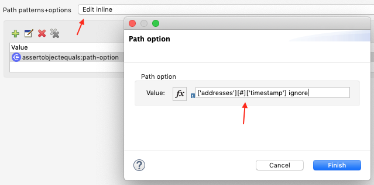

# Comparing Objects (or JSON)

The object comparison is 'hand written' and not based on an existing library. So be careful, there may be bugs. :-)

It can be used to compare object structures the way Mule uses, nested Java `List` and `Map` (or anything else with 
a meaningful `equals()` methods, but for this you don't need this connector).

The actual value and the comparison value (called expected) can be provided as object structure or in one of the follogin ways:
* InputStream
* byte[]
* OutputHandler (returned by DataWeav with mode="deferred")
* String starting with `[` or `{`
All these will be converted to an object structure by `org.codehaus.jackson.map.ObjectMapper`. Since version 1.0.0 the operation does no longer return the parsed object, it now returns the input object (in case of InputStream/OutputHandler: A copy because the stream has to be read to do the comparison).

The test for equality will drill down the object structure:
* `null` equals `null`
* Two maps are equal when they contain the same key set and the mapping is equal for map entries with the same key in the two maps.
* Two lists are equal when they have the same size and elements with same index are equal in the two lists.  
* Other objects are equal according their `equals()` method.

## Options

There are three options to tweak the comparison. They can be set globally (two of them) or on sub trees: 

1. `contains_only_on_maps`: Two maps are considered equal, when the key set of the expected map is a subset of the key set of the actual map.
(Of course, values must still be equal.) This option is useful when you want to check that some values are contained in the result.
2. `check_map_order`: This confines the comparison of the key sets of map: They must be equal and in the same order. This makes
no sense for `HashMap`, but for `LinkedHashMap` (which is used by Mule in a lots of places).
3. `ignore`: The node is ignored in the comparison. Useful to exclude values like time stamps or sequence numbers from the comparison. 
For obvious reasons this option is not available on the global level.

## Path patterns

When you want to apply one (or several) of this options to a subtree of the object structure, you have to specify the path to the subtree
by one of the following patterns:

* `?` (wildcard one): Matches one node in the tree (Map, List, leaf).
* `*` (wildcard any): Matches a sequence of nodes (can be the empty sequence).
* `[#]`: Matches a List element.
* `[42]` Matches List element with index 42 (starting at 0).
* `[-1]` Matches the last element in a List (-2 for the second last etc.).
* `['foo']` Matches the Map entry `foo`. The String between the single quotes is a regular expression.
* `['fo''o']` Matches the Map entry `fo'o` (example for quoting).
* `['foo.*']` Matches all Map entries starting with `foo` (example for the regular expression feature).

The path patterns can be combined, e.g.:

```['addresses'][#]['street']```

Matches the node `street` for each address in a list of addresses in the node `addresses`.

After the path pattern you can place one or several options shown above (separated by space).

## Examples

So let's look at some examples. I have created two JSON documents:

The expected JSON document:

```json
{
    "name": "Peter Pan",
    "addresses": [
        {
            "timestamp": 4711,
            "street": "Elm Street",
            "city": "New York"
        },
        {
            "timestamp": 4712,
            "street": "Hochstraße",
            "city": "Solingen"
        }
    ],
    "profession": "Wizard"
}
```

The actual JSON document:

```json
{
    "name": "Peter Pan",
    "profession": "Wizard",
    "addresses": [
        {
            "street": "Elm Street",
            "timestamp": 1234,
            "city": "New York"
        },
        {
            "timestamp": 1235,
            "street": "Hochstraße",
            "city": "Solingen"
        }
    ]
}
```

When you look at them closely, you will find some differences:
1. The order of the top level object is different (addresses/profession)
2. The timestamp in the addresses is different
3. The order within the addresses objects is different

Our first try will throw an `AssertionError` because of different timestamp values:

```xml
<munit:test name="compare-person-fail-test" expectedException="java.lang.AssertionError" description="MUnit Test" >
    <munit:validation >
        <assertobjectequals:compare-objects
            expected="#[MunitTools::getResourceAsString('json/person-expected.json')]"
            actual="#[MunitTools::getResourceAsString('json/person-actual.json')]" >
            <assertobjectequals:path-options />
        </assertobjectequals:compare-objects>
    </munit:validation>
</munit:test>
```
I marked the exception as expected, so the test itself will be green. (Nobody likes red bars...)

To make the object structures equal for this module, we have to exclude the timestamp from the comparison.
The first way to do this is with an embedded object:

```xml
<munit:test name="compare-person-success-1-test" description="MUnit Test" >
    <munit:validation >
        <assertobjectequals:compare-objects
            expected="#[MunitTools::getResourceAsString('json/person-expected.json')]"
            actual="#[MunitTools::getResourceAsString('json/person-actual.json')]">
            <assertobjectequals:path-options >
                <assertobjectequals:path-option value="['addresses'][#]['timestamp'] ignore" />
            </assertobjectequals:path-options>
        </assertobjectequals:compare-objects>
    </munit:validation>
</munit:test>
```

We can configure this in the GUI by clicking on the "Path patterns + options" drop-down menu and selecting "Edit inline" option.
After that we have to click on green plus sign to add our path option. Popup window will open, and allow us to enter our value.
See the picture bellow:



Another way is to express the list as a MEL expression:

```xml
<munit:test name="compare-person-success-2-test" description="MUnit Test" >
    <munit:validation >
        <assertobjectequals:compare-objects
            expected="#[MunitTools::getResourceAsString('json/person-expected.json')]"
            actual="#[MunitTools::getResourceAsString('json/person-actual.json')]"
            pathOptions="#[[&quot;['addresses'][#]['timestamp'] ignore&quot;]]">
        </assertobjectequals:compare-objects>
    </munit:validation>
</munit:test>
```

How can we fail in a different way? Activate Map order checking:

```xml
<munit:test name="compare-person-fail-map-order-test" description="MUnit Test" >
    <munit:validation >
        <assertobjectequals:compare-objects
            expected="#[MunitTools::getResourceAsString('json/person-expected.json')]"
            actual="#[MunitTools::getResourceAsString('json/person-actual.json')]"
            pathOptions="#[[&quot;['addresses'][#]['timestamp'] ignore&quot;]]"
            checkMapOrder="true">
        </assertobjectequals:compare-objects>
    </munit:validation>
</munit:test>
```

For a complete example of the test suite see [object-demos.xml](object-demos.xml).
