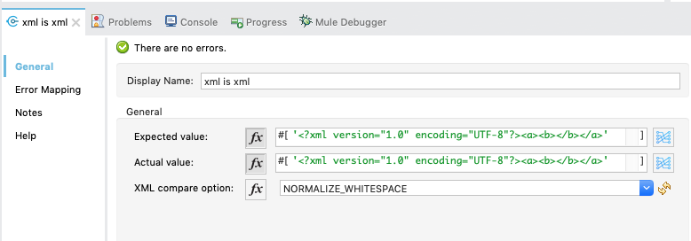

# Comparing XML

The XML comparison is based on [xmlunit](https://github.com/xmlunit/xmlunit), version 2.3.0.

For the demos in this documentation, I provided the XML as String in MEL expressions. This works only for really small XML
and the escaping of `<` and `>` makes it completely unreadable when you switch to the XML view in AnypointStudio.

Fortunately, xmlunit is quite flexible when it comes to input sources: It can consume Strings (as in the examples), byte arrays, InputStreams,
Files and some more sources. See [xmlunit documentation](https://github.com/xmlunit/user-guide/wiki/Providing-Input-to-XMLUnit) for details.

If you have bigger XML documents, place them in `src/test/resources` and load them with `getResourceAsString(...)`, e.g. like this:

```txt
"#[MunitTools::getResourceAsString('xml/simple-expected.xml')]"
```

## Simple example

So let's start with a simple example to compare two XML Strings:



As long as you ignore all the quoting, it's quite simple in XML, too:
```xml
<munit:test name="compare-xml" description="Munit Test">
    <munit:validation >
        <assertobjectequals:compare-xml doc:name="xml is xml"
            expected="#['&lt;?xml version=&quot;1.0&quot; encoding=&quot;UTF-8&quot;?&gt;&lt;a&gt;&lt;b&gt;&lt;/b&gt;&lt;/a&gt;']"
            actual="#['&lt;?xml version=&quot;1.0&quot; encoding=&quot;UTF-8&quot;?&gt;&lt;a&gt;&lt;b&gt;&lt;/b&gt;&lt;/a&gt;']"
            xmlCompareOption="NORMALIZE_WHITESPACE">
        </assertobjectequals:compare-xml>
    </munit:validation>
</munit:test>
```

## Handling whitespace and comments

Usually we don't want to compare our XML documents character by character, otherwise we could just use the built in assert of MUnit.

We can select between three modes of comparison:

* NORMALIZE_WHITESPACE : Normalize Text-Elements by removing all empty text nodes and normalizing the non-empty ones.
* IGNORE_WHITESPACE: Ignore whitespace by removing all empty text nodes and trimming the non-empty ones.
* IGNORE_COMMENTS: Will remove all comment-Tags "<!-- Comment -->" from test- and control-XML before comparing.
"normalized" in this context means all whitespace characters are replaced by space characters and consecutive
whitespace characters are collapsed.

For a complete example of the test suite see [xml-demos.xml](xml-demos.xml).
